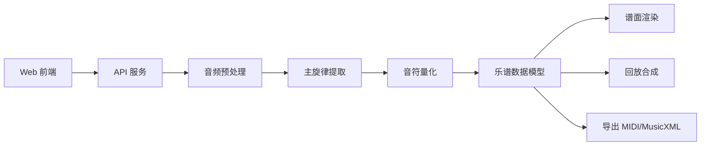
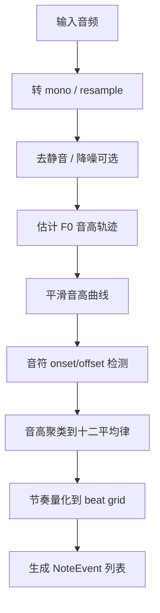

# TuneNote 设计文档

## 1. 总体架构

MVP 建议采用前后端分离架构：



### 1.1 前端职责

- 录音与音频文件上传。
- 原始音频预览。
- 调用后端识别接口。
- 展示五线谱和简谱。
- 播放生成旋律。
- 提供基础编辑交互。

### 1.2 后端职责

- 接收音频文件。
- 音频格式转换与预处理。
- 主旋律音高估计。
- 音符切分与节奏量化。
- 生成统一谱面数据结构。
- 输出 MIDI / MusicXML。

## 2. 推荐技术栈

### 2.1 前端

- React + Vite + TypeScript。
- Web Audio API / MediaRecorder API：录音与音频播放。
- VexFlow：五线谱渲染。
- 自定义简谱组件：基于内部 note 数据渲染。
- Tone.js：浏览器内回放合成。

### 2.2 后端

- Python + FastAPI。
- librosa：音频加载、节拍分析、基础音频处理。
- Spotify Basic Pitch 或 CREPE：主旋律/音高估计候选。
- pretty_midi：MIDI 生成。
- music21：MusicXML 生成、调性/拍号处理。

### 2.3 文件结构建议

```text
tunenote/
  doc/
    requirements.md
    design.md
    progress.md
  app/
    frontend/
      package.json
      src/
        components/
        pages/
        lib/
    backend/
      pyproject.toml
      tunenote_api/
        main.py
        audio/
        transcription/
        score/
```

## 3. 核心数据模型

内部统一使用 `ScoreDraft` 表示识别结果，避免五线谱、简谱、MIDI 各自维护不同结构。

```ts
export type ScoreDraft = {
  id: string;
  title: string;
  tempo: number;
  timeSignature: string;
  key: string;
  notes: NoteEvent[];
};

export type NoteEvent = {
  id: string;
  midi: number;
  pitch: string;
  startBeat: number;
  durationBeat: number;
  velocity?: number;
  confidence?: number;
};
```

### 3.1 五线谱渲染

- 输入：`ScoreDraft.notes`
- 处理：按小节分组，将 MIDI note 转换成 VexFlow note。
- 输出：SVG 五线谱。

### 3.2 简谱渲染

- 输入：`ScoreDraft.key` + `ScoreDraft.notes`
- 处理：将 MIDI note 转换成调内级数。
- 输出：数字谱，例如 `1 2 3 5 | 6 - 5 -`。

### 3.3 回放合成

- 输入：`ScoreDraft.notes`
- 处理：根据 tempo 将 beat 转换为秒。
- 输出：Tone.js 合成音或后端 MIDI 音频。

## 4. 主旋律提取流程



### 4.1 音高轨迹

MVP 可选方案：

1. **Basic Pitch 优先**
   - 优点：已有 note event 输出，适合快速 MVP。
   - 缺点：复杂音频仍可能误识别。

2. **librosa.pyin / CREPE**
   - 优点：适合单音旋律 F0 追踪。
   - 缺点：需要自己做音符切分和量化。

建议：第一版使用 Basic Pitch 获取音符候选，再做后处理和可视化编辑。

### 4.2 音符量化

输入候选：

```json
{
  "startSec": 0.23,
  "endSec": 0.71,
  "midi": 64,
  "confidence": 0.83
}
```

量化步骤：
1. 根据 tempo 或 beat tracking 将 `startSec` 转换为 `startBeat`。
2. 将持续时间映射到常见节奏单位：1/4、1/2、1、2 beat。
3. 合并持续时间极短且音高相近的碎片音。
4. 标记低置信度音符，交给用户修正。

## 5. API 设计

### 5.1 上传并识别

`POST /api/transcribe`

请求：`multipart/form-data`

字段：
- `audio`: 音频文件。
- `tempo`: 可选。
- `timeSignature`: 可选，默认 `4/4`。
- `key`: 可选，默认自动估计或 `C`。

响应：

```json
{
  "score": {
    "id": "draft_001",
    "title": "Untitled",
    "tempo": 96,
    "timeSignature": "4/4",
    "key": "C",
    "notes": []
  },
  "warnings": ["Some notes have low confidence"]
}
```

### 5.2 导出 MIDI

`POST /api/export/midi`

请求：`ScoreDraft`

响应：`.mid` 文件。

### 5.3 导出 MusicXML

`POST /api/export/musicxml`

请求：`ScoreDraft`

响应：`.musicxml` 文件。

## 6. 前端页面设计

MVP 一个页面即可：

```text
┌──────────────────────────────────────────┐
│ TuneNote                                  │
├──────────────────────────────────────────┤
│ [录音] [停止] [上传音频] [开始识别]         │
│ 原始音频播放器                             │
├──────────────────────────────────────────┤
│ 参数：调号 [C]  拍号 [4/4]  速度 [96]       │
├──────────────────────────────────────────┤
│ 五线谱视图                                │
│ 简谱视图                                  │
├──────────────────────────────────────────┤
│ [播放生成旋律] [导出 MIDI] [导出 MusicXML] │
└──────────────────────────────────────────┘
```

## 7. 迭代路线

### V0.1：可演示原型

- 创建前端页面。
- 支持上传音频。
- 后端返回模拟 `ScoreDraft`。
- 前端展示五线谱/简谱和回放。

### V0.2：真实识别链路

- 接入 Basic Pitch 或 librosa.pyin。
- 输出真实音符序列。
- 支持 MIDI 导出。

### V0.3：可修正谱面

- 支持编辑音符音高和时值。
- 低置信度音符高亮。
- 支持 MusicXML 导出。

### V0.4：体验优化

- 支持录音。
- 支持结果保存。
- 优化节奏量化和调性估计。
