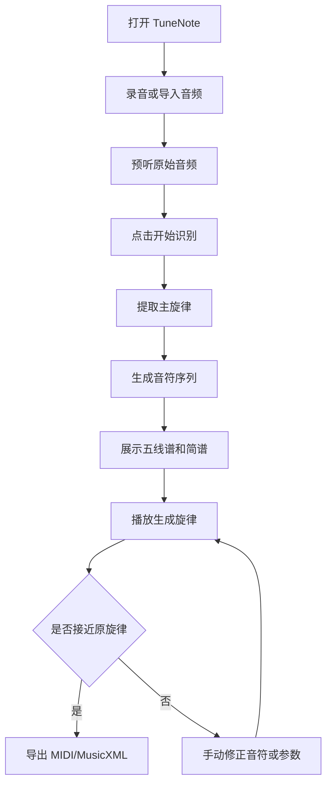

# TuneNote 需求文档

## 1. 项目目标

TuneNote 是一个面向音乐学习者和创作者的音乐辅助应用。首个版本聚焦“听曲写谱”：用户录制或导入一段短旋律音频，系统提取其中主要旋律，生成五线谱与简谱，并支持根据生成的谱回放合成音乐，用于对比原始旋律与识别结果是否接近。

## 2. MVP 范围

### 2.1 核心功能

1. **录音 / 音频输入**
   - 用户可以录制一段短音频。
   - 用户可以导入本地音频文件。
   - MVP 建议限制音频长度：5–30 秒。
   - 支持单旋律优先，如哼唱、单件乐器旋律、主旋律清晰的人声片段。

2. **主旋律提取**
   - 从音频中估计主旋律音高轨迹。
   - 将连续音高转换为离散音符。
   - 识别基础节奏时值。
   - 输出调性、拍号、速度等可编辑元信息。

3. **谱面生成**
   - 生成五线谱。
   - 生成简谱。
   - 展示每个音符的音高、时值和小节位置。
   - MVP 允许用户手动修正调号、拍号、速度和个别音符。

4. **谱面回放**
   - 根据识别出的音符序列合成 MIDI 或简单音色音频。
   - 用户可以播放生成旋律。
   - 用户可以播放原始录音进行对比。

5. **结果导出**
   - 导出 MIDI。
   - 导出 MusicXML 或 LilyPond 源文件。
   - 导出谱面图片或 PDF 可作为后续版本。

### 2.2 非目标功能（MVP 暂不做）

- 多声部自动扒谱。
- 完整伴奏、和弦、鼓点识别。
- 人声歌词识别。
- 专业级 DAW 编辑能力。
- 复杂混音音频中的精准主旋律分离。

## 3. 用户流程



## 4. 输入与输出

### 4.1 输入

- 音频来源：麦克风录音、本地文件。
- 推荐格式：wav、mp3、m4a。
- 推荐采样率：16kHz 或 44.1kHz。
- 推荐内容：单音旋律、主旋律突出、背景噪声较低。

### 4.2 输出

识别后的内部音符结构：

```json
{
  "title": "Untitled",
  "tempo": 96,
  "timeSignature": "4/4",
  "key": "C",
  "notes": [
    {
      "pitch": "C4",
      "midi": 60,
      "startBeat": 0,
      "durationBeat": 1,
      "confidence": 0.92
    }
  ]
}
```

前端展示输出：
- 五线谱视图。
- 简谱视图。
- 原始音频播放器。
- 生成音频播放器。

文件导出输出：
- `.mid`
- `.musicxml`
- 后续支持 `.pdf` / `.png`

## 5. 质量要求

### 5.1 识别质量

MVP 的目标不是专业级全自动扒谱，而是“可用、可修正、能快速得到旋律草稿”。

建议指标：
- 单音哼唱或单乐器旋律：音高识别主观可接受率 ≥ 80%。
- 节奏识别允许有误差，但小节结构应基本可读。
- 用户能通过少量编辑修正结果。

### 5.2 交互质量

- 录音、识别、展示、回放流程应在一个页面内完成。
- 识别过程需要有进度提示。
- 对识别置信度低的音符做可视化标记。
- 用户应能快速比较“原音频”和“生成旋律”。

## 6. 技术约束与建议

- 优先做 Web 应用，便于快速验证。
- 前端可用 React / Vue / Svelte；初版建议 React + Vite。
- 音频处理初期可以在后端用 Python 完成，便于使用 librosa、basic-pitch、pretty_midi、music21 等生态。
- 谱面渲染可调研 VexFlow、OpenSheetMusicDisplay、ABC notation、LilyPond。
- MVP 可先使用现成模型/库完成旋律提取，再逐步优化算法。

## 7. 风险

1. **复杂音频识别难度高**
   - 缓解：明确 MVP 只支持主旋律清晰音频。

2. **节奏量化容易不准**
   - 缓解：提供 tempo、拍号、音符时值手动修正。

3. **五线谱与简谱转换存在调性依赖**
   - 缓解：内部统一使用 MIDI note + beat，再分别渲染。

4. **浏览器录音兼容性**
   - 缓解：优先支持 Chrome / Edge，后续扩展。
